Learning Online Application

-------------------------------------------------------------------------------------------------------------------------------------------------------------------------------------------------------------
Description:
A modern web application that provides online programming and non-programming courses basing on IOT english web, allowing students to do english test in online.

Author:

Nguyen Huynh Phuong Loc

+ Database design

+ Come up with ideas

+ Handle logic and build almost all functions for this project

+ Code optimization

Huynh Thanh Tuan

+ Create use case diagrams

+ Build interfaces of web

Create BFD

Build 1 function

------------------------------------------------------------------------------------------------------------------------------------

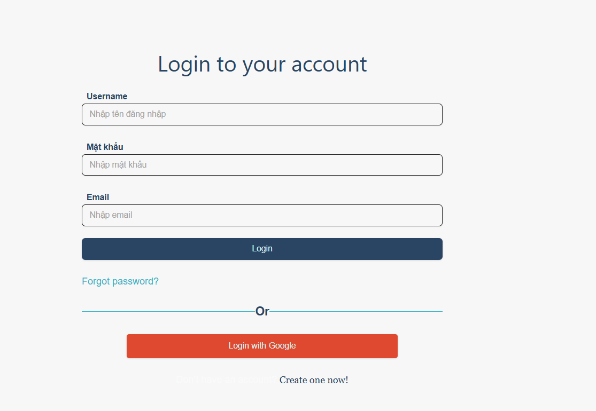

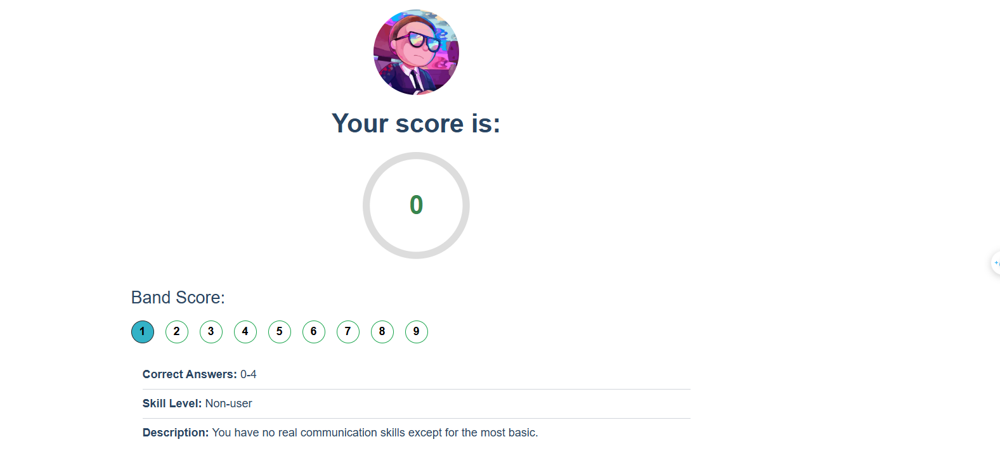

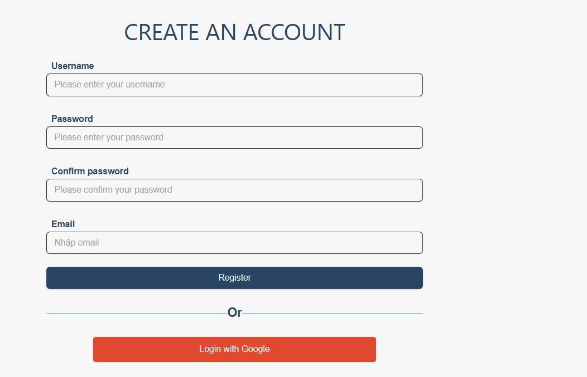

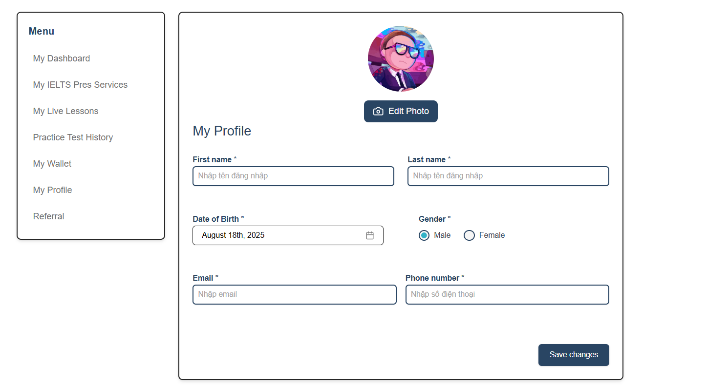

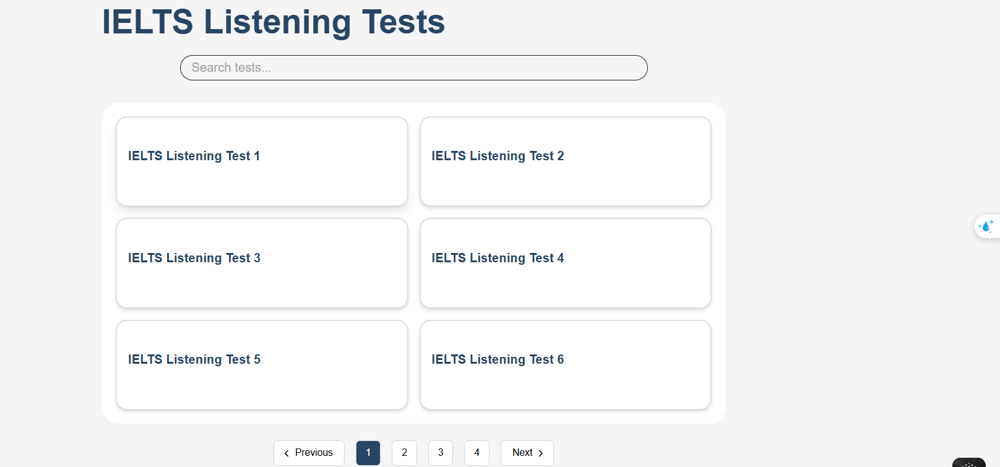

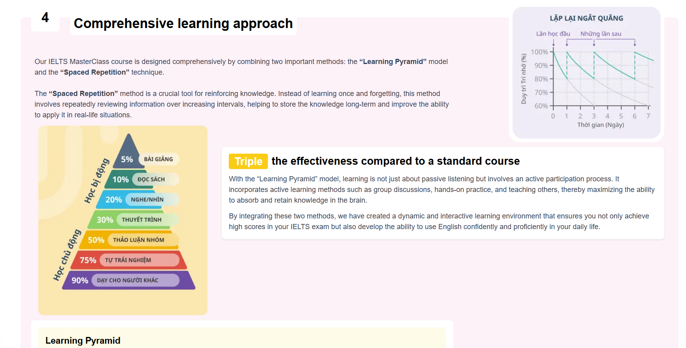

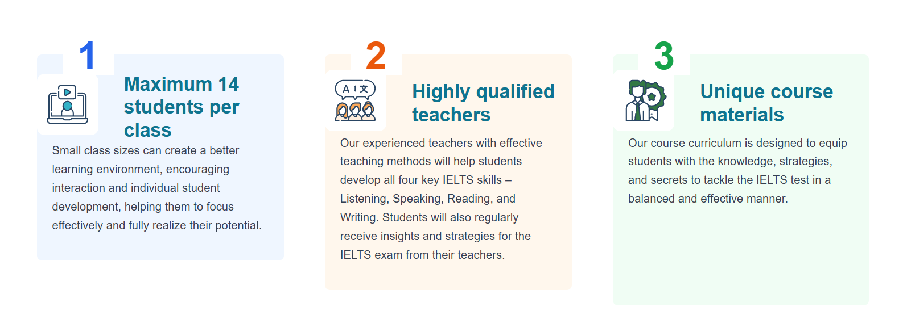

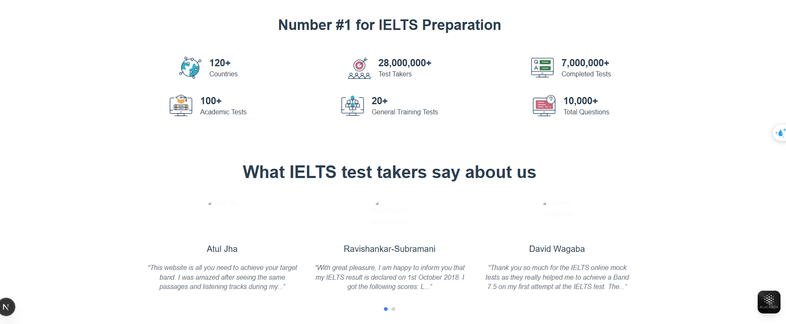

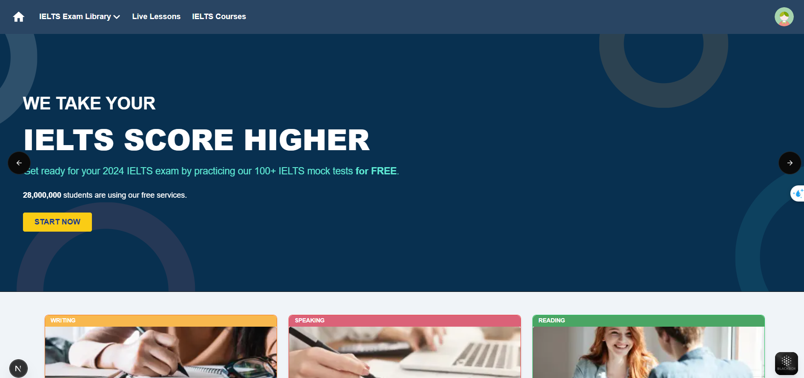

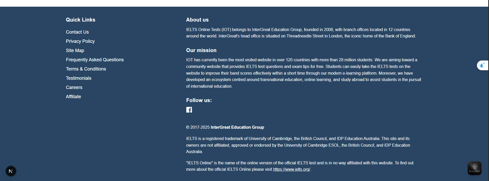

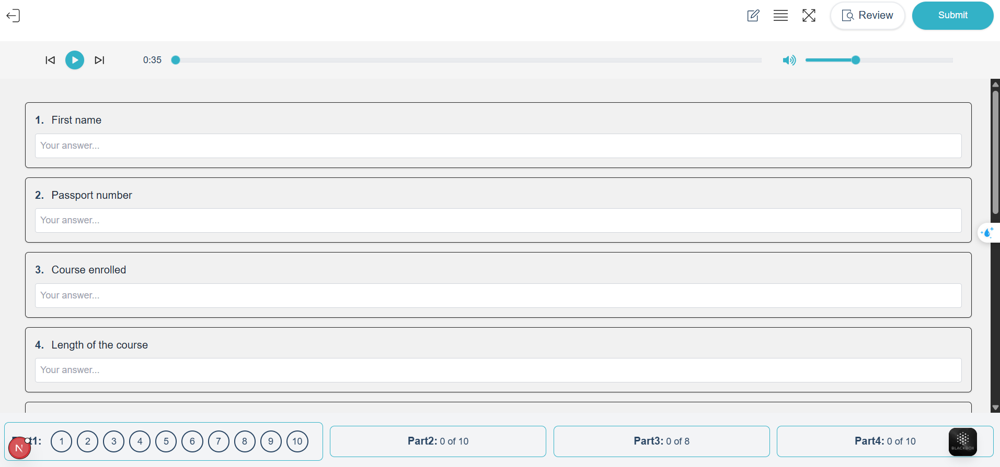

-------------------------------------------------------------------------------------------------------------------------------------

Technology Used

+ Back-End

- Programming Language: TypeScript

- Framework: NestJS

- Libraries: @nestjs/core, @nestjs/common, @nestjs/typeorm / mongoose, jsonwebtoken, bcrypt,class-validator, class-transformer,multer 

- Database: MongoDB

+ Front-End

- Programming Language: TypeScript

- Libraries: react, axios

- Framework: Next.js

- UI Framework: Tailwind CSS, Shadcn/UI

----------------------------------------------------------------------------------------------
Development Environment

Visual Studio Code

Node.js v18+

Deployment Environment

Docker

